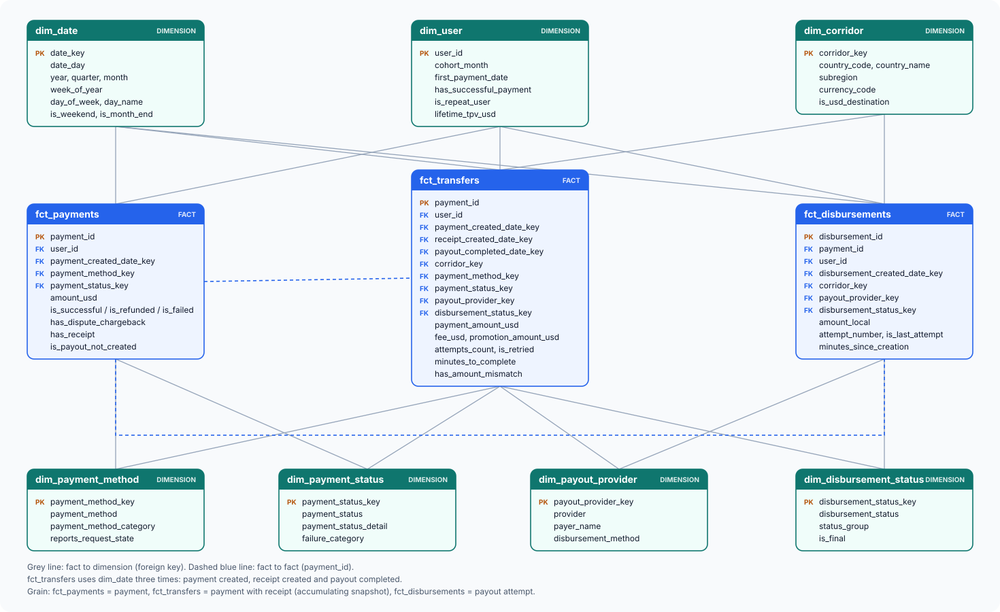

# Data modeling

Dimensional model built on top of the staging layer (`DBT/models/`). Built with dbt on BigQuery, project `felix-technical-test`, dataset `dbt_dev_local` (target `dev`). The earlier cross-table checks that drove the design are in [data-relationship-validation.md](data-relationship-validation.md).



Contents:
1. [Business context and metrics](#1-business-context-and-metrics)
2. [Layers and folder layout](#2-layers-and-folder-layout)
3. [Step 1: validate the relationships](#3-step-1-validate-the-relationships)
4. [Step 2: transformations](#4-step-2-transformations-modelstransformations)
5. [Step 3: dimensions](#5-step-3-dimensions-modelsdim)
6. [Step 4: facts](#6-step-4-facts-modelsfact)
7. [Step 5: marts](#7-step-5-marts-modelsmart)
8. [Slowly changing dimensions](#8-slowly-changing-dimensions)
9. [Tests and data quality](#9-tests-and-data-quality)
10. [Known limitations and decisions](#10-known-limitations-and-decisions)

---

## 1. Business context and metrics

A remittance is a **payment** (charge in USD to the sender) followed by a **disbursement** (payout in local currency to the beneficiary). **Receipts** link a payment to each payout attempt, so a payment with a retried payout has several receipts.

The model is designed to answer these questions:

| Area | Metrics |
|---|---|
| Volume and revenue | TPV (USD charged), fee revenue, take rate (fee / TPV), promotion cost, net revenue, average ticket |
| Payment conversion | Success rate by payment method, failures by cause (funds, fraud, 3DS, card, provider), refund rate |
| Payout quality | Completion rate, retries, delivery time, payouts on hold, by provider and corridor |
| Corridors | Volume, fees and success by destination country and currency, FX rate |
| Users | Active senders, new vs. repeat, cohort retention, TPV per user |
| Risk | Dispute and chargeback rate, fraud-related failures |
| Data quality | Amount mismatches, missing links between tables, invalid timestamps |

## 2. Layers and folder layout

```
sources (felix_dataset, external tables over CSV)
   -> staging          models/staging/          views: clean, rename, deduplicate
   -> transformations  models/transformations/  tables: business joins (trf_*)
   -> dim / fact       models/dim/, models/fact/  tables: star schema
   -> mart             models/mart/             tables: aggregated KPIs
```

| Layer | Prefix | Materialization | Models |
|---|---|---|---|
| Staging | `stg_remittances__` | view | 3 |
| Transformations | `trf_` | table | 3 |
| Dimensions | `dim_` | table | 7 |
| Facts | `fct_` | table | 3 |
| Marts | `mart_` | table | 6 |

Materializations are set per folder in `DBT/dbt_project.yml`. Two macros are shared by the layers: `generate_surrogate_key` (hash key from a list of columns) and `date_key` (integer `yyyymmdd` from a timestamp, UTC).

## 3. Step 1: validate the relationships

Before choosing any grain, the three raw tables were profiled against each other (full detail in [data-relationship-validation.md](data-relationship-validation.md)). The findings that shaped the model:

- `payments` to `receipts` is 1:N (0 to 8 receipts, 13,215 retried payments). `receipts` to `disbursements` is 1:1.
- Every retry repeats the full amount, so **summing receipts overstates TPV by about 3.1%**. Money must come from the payment and one receipt only.
- 185 receipts point to a disbursement that does not exist; 1,961 successful payments have no receipt; 957 payments do not satisfy `payment amount = amount_charged + fee`.
- `user_id` is consistent across the three tables and each beneficiary belongs to a single user.

Decision: money is read at payment grain from the **last** receipt; disbursement metrics are read at attempt grain.

## 4. Step 2: transformations (`models/transformations/`)

Business logic that does not belong in staging and is reused by several facts.

| Model | Grain | Rows | What it does |
|---|---|---|---|
| `trf_payment_receipts` | receipt (payout attempt) | 743,948 | Joins each receipt with its disbursement (left join, so the 185 broken links stay). Adds `attempt_number`, `attempts_count` and `is_last_attempt`, ordering the attempts of a payment by receipt creation time. |
| `trf_transfers` | payment with at least one receipt | 728,227 | Takes the last attempt of each payment and joins it to the payment. Computes `expected_amount_usd`, `amount_diff_usd`, `has_amount_mismatch` and `amount_mismatch_type`, `payout_completed_at` and `minutes_to_complete`. |
| `trf_user_activity` | sender | 421,412 | First and last successful payment, payment counts and lifetime TPV per `user_id`. |

Amount mismatch types in `trf_transfers`: `FEE_NOT_RECORDED` (payment higher and receipt fee is 0), `RECEIPT_HIGHER`, `NEGATIVE_OR_ZERO_AMOUNT` and `OTHER`.

## 5. Step 3: dimensions (`models/dim/`)

Dimensions use a hash surrogate key built with `generate_surrogate_key`, except `dim_date` (`yyyymmdd`) and `dim_user` (natural `user_id`). Nulls are replaced with `UNKNOWN` or `NONE` so facts never carry a null foreign key to these dimensions.

| Dimension | Grain | Rows | Notes |
|---|---|---|---|
| `dim_date` | day | 365 | 2026-01-01 to 2026-12-31 (source data goes to 2026-09-22). ISO day of week (1 = Monday). |
| `dim_corridor` | destination country + currency | 15 | Country name, subregion, `is_usd_destination`. A country can appear with its local currency and with USD. |
| `dim_payment_method` | method | 6 | CARD, APPLE_PAY, CASH, WALLET_POC, ACH and UNKNOWN, with a category. |
| `dim_payment_status` | status + detailed status | 29 | Adds `failure_category`: INSUFFICIENT_FUNDS, FRAUD_RISK, AUTHENTICATION, INVALID_CARD, PROVIDER_OR_BANK, INVALID_REQUEST, UNKNOWN_REASON. |
| `dim_disbursement_status` | normalized status | 20 | Resolves mixed casing and vocabularies (`Success`, `PAID`, `COMPLETED`); adds `status_group` and `is_final`. |
| `dim_payout_provider` | provider + payer + payout method | 478 | The same payer can work with a provider through more than one payout method. |
| `dim_user` | sender | 421,412 | Cohort month, first payment date, `is_repeat_user`, lifetime TPV. |

**Why there is no `dim_state`.** `location_of_request_state_code` is filled in only 0.05% of payments (428 of 788,976), and only for CASH (37% of its rows) and ACH (2%). Card and Apple Pay, 98.8% of the volume, never report it. The values are also dirty (`US-TX` vs `TX`, Mexican states such as `ROO` and `CMX`, `ENG`). The column is kept as a degenerate attribute in `fct_payments`.

## 6. Step 4: facts (`models/fact/`)

| Fact | Grain | Rows | Role |
|---|---|---|---|
| `fct_payments` | payment, any status | 788,976 | Conversion, refunds, disputes. Flags `is_payout_not_created` for the 1,961 successful payments with no receipt. |
| `fct_disbursements` | payout attempt | 743,763 | Payout success, retries and delivery time. Corridor comes from the receipt because the country in disbursements is incomplete. |
| `fct_transfers` | payment with receipt | 728,227 | TPV, fees, take rate and delivery time. Accumulating snapshot with three milestone dates (payment created, receipt created, payout completed). |

Design points:

- **Foreign keys.** Every fact column ending in `_key` points to a dimension; `fct_transfers` uses `dim_date` three times as a role-playing dimension. `payout_completed_date_key` stays null until the payout completes. `payout_provider_key` and `disbursement_status_key` are null when the disbursement is missing in the source.
- **Additive measures.** `payment_amount_usd`, `amount_charged_usd`, `fee_usd`, `promotion_amount_usd` and `destination_amount_local` can be summed. `exchange_rate` and `minutes_to_complete` are not additive.
- **Reconciliation.** TPV in `fct_transfers` equals TPV of the same payments in `fct_payments` (singular test `assert_fct_transfers_tpv_matches_payments`).
- **Reference figures** (successful transfers): 722,091 transfers, 237.69M USD TPV, 2.90M USD fees, take rate 1.22%.

## 7. Step 5: marts (`models/mart/`)

| Mart | Grain | Main metrics |
|---|---|---|
| `mart_finance_daily` | day x corridor x payment method | Transfers, active senders, TPV, principal, fee revenue, promotion cost, net revenue, take rate, average ticket. Successful payments only. |
| `mart_payment_conversion` | day x payment method | Payments, success and refund rates, amounts, failures split by category. |
| `mart_payout_performance` | day x provider x corridor | Attempts by status group, completion rate, retry rate, average and median minutes to complete. |
| `mart_user_cohorts` | cohort month x activity month | Cohort size, active users, retention rate, TPV per cohort user. |
| `mart_user_daily` | user x day | Successful transfers, TPV, fees, promotions, average ticket, methods and corridors used, retries, disputes, cohort and days since first payment. Only days with a successful payment. |
| `mart_risk` | month x payment method | Disputed payments and amount, dispute rate, refund rate, fraud-related failure rate. |
| `mart_data_quality` | month x check x issue type | Affected records and percentage, net and absolute amount involved. |

`mart_data_quality` is a monitor, not a correction. Current checks: `AMOUNT_MISMATCH` (by type), `RECEIPT_WITHOUT_DISBURSEMENT`, `FAILED_PAYMENT_WITH_RECEIPT`, `SUCCESSFUL_PAYMENT_WITHOUT_RECEIPT` and `DISBURSEMENT_TIMESTAMPS` (null `updated_at` or earlier than `created_at`). New checks are added as another union branch. Records are never excluded from the facts: they carry flags so each analysis decides.

Checks run on the build (full dataset): marts reconcile with the facts (finance TPV 237,689,757 USD, conversion and risk cover the 788,976 payments, payout performance covers the 743,763 attempts) and cohort month 0 retention is 100%.

## 8. Slowly changing dimensions

The data is a static extract: no new data will arrive and the source keeps no attribute history, only the latest state of each row. All dimensions are therefore **SCD Type 1**.

| Dimension | Type | Reason |
|---|---|---|
| `dim_date` | static | Calendar. |
| `dim_corridor`, `dim_payment_method`, `dim_payment_status`, `dim_disbursement_status`, `dim_payout_provider` | Type 1 | Catalogs derived from the data, with no attribute history. |
| `dim_user` | Type 1 | The source has no user attributes. Derived attributes (cohort, first payment date) never change; lifetime counters are recomputed each run. |

Snapshots (SCD Type 2) were not implemented because they only record changes from their first run onward and nothing will change here. In a live pipeline two snapshots would be worth adding:

- `dim_user`: snapshot of `trf_user_activity` to keep the history of an activity segment (new, active, inactive).
- Disbursement status: snapshot of `stg_remittances__disbursements` on `updated_at`, to measure how long a payout stays in states such as ON_HOLD, since the source overwrites the status.

## 9. Tests and data quality

- **Generic tests** (`_models.yml` in each folder): `unique` and `not_null` on keys, `relationships` from every fact key to its dimension, and `accepted_values` on categorical columns. Catalog value checks (new country, status or failure reason) are `warn`, so a new value does not break the build.
- **Singular tests** (`DBT/tests/`):
  - `assert_fct_transfers_tpv_matches_payments`: TPV of the facts reconciles.
  - `assert_mart_rates_between_0_and_1`: every rate in the marts is between 0 and 1.
  - `assert_mart_grains_are_unique`: the declared grain of each mart holds.
  - Staging tests: see [dbt-tests.md](dbt-tests.md).
- Source data issues are not hidden by tests: they are exposed in `mart_data_quality`.
- **Latest full run** (`dbt build`, 2026-10-07): 190 nodes, 180 success, 6 warnings, 1 error, 3 skipped. All transformations, dimensions, facts, marts and their tests pass. The 6 warnings are the known source data issues (negative payment amount, null `amount_local` and `destination_country_code` in disbursements, invalid receipt amounts, receipts without disbursement, payment vs receipt amounts). The error and the 3 skipped nodes belong to the dbt starter models in `models/example/` (`my_first_dbt_model` has a null id), which are not part of this model and can be deleted.

## 10. Known limitations and decisions

| Topic | Decision |
|---|---|
| 957 payments (0.13%) whose amount differs from `amount_charged + fee` | Kept in the facts with `has_amount_mismatch` and `amount_mismatch_type`; monitored in `mart_data_quality`. 731 are a fee not recorded in the receipt (+2,687 USD). The business rule behind the rest is not confirmed. |
| Receipts pointing to a missing disbursement (185 receipts, 10 of them the last attempt of the payment) | Left join; payout keys are null and `has_disbursement` is false. |
| 1,961 successful payments without receipt | Flagged `is_payout_not_created` in `fct_payments`; mostly from the last months of the extract. |
| Disbursement timestamps (816 null `updated_at`, 18 earlier than `created_at`) | `minutes_since_creation` is null for them. |
| Corridor `MX-GTQ` (3 receipts) | Kept as its own corridor, probably a data error. |
| `dim_date` range is fixed in the SQL | Extend the end date if data after 2026-12-31 arrives, or derive the range from staging. |
| Source data is a static extract | No snapshots or incremental models. |
