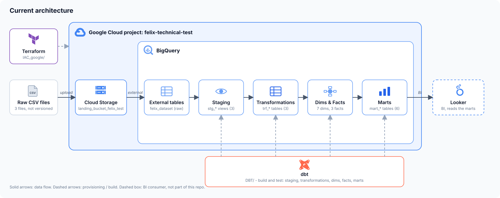

# Felix-DE-test
Repo to develop Data Engineer Manager test to Felix

## Architecture



| Layer | Tool | Location |
|---|---|---|
| Infrastructure | Terraform | `IAC_google/` |
| Raw | GCS + BigQuery external tables | `felix_dataset` |
| Staging | dbt views (dedup, rename, status normalization) | `DBT/models/staging/` |
| Transformations | dbt tables (receipts with attempts, transfers, user activity) | `DBT/models/transformations/` |
| Dimensions and facts | dbt tables, star schema (7 dimensions, 3 facts) | `DBT/models/dim/`, `DBT/models/fact/` |
| Marts | dbt tables (finance, conversion, payouts, cohorts, user daily, risk, data quality) | `DBT/models/mart/` |

dbt models are built in the dataset set in the dbt profile (`dbt_dev_local` for the `dev` target).


Documentation:

| Document | Content |
|---|---|
| [`Documentation/project-progress.md`](Documentation/project-progress.md) | Everything built so far: IAC, schema findings, staging, data model, pending work |
| [`Documentation/data-modeling.md`](Documentation/data-modeling.md) | Step by step description of the dimensional model, with the diagram |
| [`Documentation/data-relationship-validation.md`](Documentation/data-relationship-validation.md) | Validation of the relationships between payments, receipts and disbursements |
| [`Documentation/dbt-tests.md`](Documentation/dbt-tests.md) | Staging test results and decisions |

## Infrastructure as Code (`IAC_google/`)

Terraform that deploys the landing layer on GCP (`felix-technical-test`):

- **Cloud Storage:** bucket `landing_bucket_felix_test` with the CSV files under `data/`.
- **BigQuery:** dataset `felix_dataset` with one external table per CSV (`payments`, `receipts`, `disbursements`) and an explicit schema from `schemas/*.json`.

Files and external tables are created with `for_each` over `var.external_tables`. To add a table, add an entry in `terraform.tfvars`, a schema in `schemas/` and the CSV in `files/`.

```bash
cd IAC_google
terraform init
terraform apply
terraform destroy
```

Notes:
- **Large CSVs are not versioned.** Copy the full files to `IAC_google/files/` before `terraform apply`; they are git-ignored and uploaded to GCS. Samples (10 rows) are in `IAC_google/files/samples/`.
- `force_destroy = true` and `deletion_protection = false` are for a test environment only.
- `force_destroy` is read from state: run `terraform apply` before `terraform destroy` if you change it.
- Local state is excluded via `.gitignore`.

## dbt (`DBT/`)

Staging views, transformations, a star schema (dimensions and facts) and marts over the raw tables, with generic and singular tests. Requires a BigQuery profile named `default` in `~/.dbt/profiles.yml`.

```
models/
  srcs/              sources (raw external tables)
  staging/           stg_remittances__* views
  transformations/   trf_* tables (business joins)
  dim/               dim_* tables
  fact/              fct_* tables
  mart/              mart_* tables
macros/              generate_surrogate_key, date_key
tests/               singular tests
```

```bash
cd DBT
dbt debug
dbt build                       # everything
dbt build --select staging      # one layer
dbt build --select +mart_finance_daily   # a mart and everything it depends on
```

Note: `models/example/` holds the dbt starter models; `my_first_dbt_model` fails its `not_null` test, so a full `dbt build` reports one error until they are removed.
