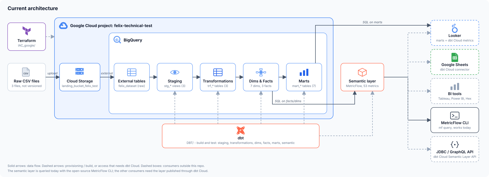
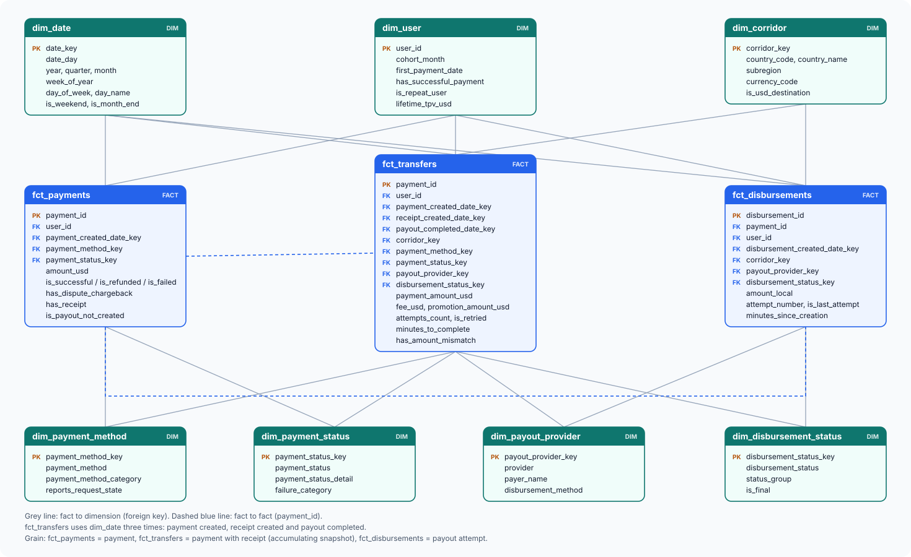

# Felix-DE-test
Data engineering take-home for Felix: a remittances pipeline on GCP. Terraform lands the raw CSVs in GCS and BigQuery, and dbt builds staging, a star schema, marts and a semantic layer on top.

## Architecture



| Layer | Tool | Location |
|---|---|---|
| Infrastructure | Terraform | `IAC_google/` |
| Raw | GCS + BigQuery external tables | `felix_dataset` |
| Staging | dbt views (dedup, rename, status normalization) | `DBT/models/staging/` |
| Transformations | dbt tables (receipts with attempts, transfers, user activity) | `DBT/models/transformations/` |
| Dimensions and facts | dbt tables, star schema (7 dimensions, 3 facts) | `DBT/models/dim/`, `DBT/models/fact/` |
| Marts | dbt tables (finance, conversion, payouts, cohorts, user daily, risk, data quality) | `DBT/models/mart/` |
| Semantic layer | MetricFlow semantic models and 53 KPI metrics over the facts and dimensions | `DBT/models/semantic/` |

dbt models are built in the dataset set in the dbt profile (`dbt_dev_local` for the `dev` target).



Documentation:

| Document | Content |
|---|---|
| [`Documentation/project-progress.md`](Documentation/project-progress.md) | Everything built so far: IAC, schema findings, staging, data model, pending work |
| [`Documentation/data-modeling.md`](Documentation/data-modeling.md) | Step by step description of the dimensional model, with the diagram |
| [`Documentation/data-relationship-validation.md`](Documentation/data-relationship-validation.md) | Validation of the relationships between payments, receipts and disbursements |
| [`Documentation/dbt-tests.md`](Documentation/dbt-tests.md) | Staging test results and decisions |
| [`Documentation/business-questions-and-kpis.md`](Documentation/business-questions-and-kpis.md) | KPIs and business questions answered by the marts, by domain |

Diagrams live in `Documentation/images/`. The architecture SVG is generated with `python3 Documentation/images/generate_architecture.py` (needs network access for the logos); the dimensional model SVG is edited directly.

## Infrastructure as Code (`IAC_google/`)

Terraform that deploys the landing layer on GCP (`felix-technical-test`):

- **Cloud Storage:** bucket `landing_bucket_felix_test` with the CSV files under `data/`.
- **BigQuery:** dataset `felix_dataset` with one external table per CSV (`payments`, `receipts`, `disbursements`) and an explicit schema from `schemas/*.json`.

Files and external tables are created with `for_each` over `var.external_tables`. To add a table, add an entry in `terraform.tfvars`, a schema in `schemas/` and the CSV in `files/`.

```bash
cd IAC_google
terraform init
terraform apply
terraform destroy
```

Notes:
- **Large CSVs are not versioned.** Copy the full files to `IAC_google/files/` before `terraform apply`; they are git-ignored and uploaded to GCS. Samples (10 rows) are in `IAC_google/files/samples/`.
- `force_destroy = true` and `deletion_protection = false` are for a test environment only.
- `force_destroy` is read from state: run `terraform apply` before `terraform destroy` if you change it.
- Local state is excluded via `.gitignore`.

## dbt (`DBT/`)

Staging views, transformations, a star schema (dimensions and facts), marts and a semantic layer over the raw tables, with generic and singular tests. Requires a BigQuery profile named `default` in `~/.dbt/profiles.yml`.

```
models/
  srcs/              sources (raw external tables)
  staging/           stg_remittances__* views
  transformations/   trf_* tables (business joins)
  dim/               dim_* tables
  fact/              fct_* tables
  mart/              mart_* tables
  semantic/          MetricFlow semantic models, metrics and time spine
macros/              generate_surrogate_key, date_key
tests/               singular tests
```

```bash
cd DBT
dbt debug
dbt build                       # everything
dbt build --select staging      # one layer
dbt build --select +mart_finance_daily   # a mart and everything it depends on
```

### Semantic layer

`DBT/models/semantic/` defines semantic models on the facts and dimensions (not on the marts), so ratios such as take rate or success rate are recomputed from additive measures at any grain. It holds 53 metrics for revenue, conversion, payouts, customers and risk. Cumulative and month-offset metrics are left to the BI layer because MetricFlow generates SQL that BigQuery rejects.

`dbt sl` needs a dbt Cloud project, so the layer is validated and queried locally with the open-source MetricFlow CLI:

```bash
python3 -m venv .venv && source .venv/bin/activate
pip install dbt-metricflow dbt-bigquery
cd DBT
export DBT_PROFILES_DIR=~/.dbt
dbt parse --no-partial-parse
mf validate-configs
mf list metrics
mf query --metrics tpv_usd,take_rate --group-by metric_time__month,corridor__country_name
```

`mf` also names the METAFONT binary from TeX on some Macs; call it through the virtualenv if `which mf` points to `/Library/TeX`.
